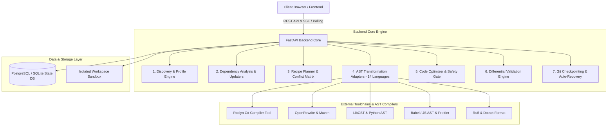

# 🚀 SystemaOps Modernization Platform
### *Enterprise Application Modernization & Automated Migration Engine*

---

## 🎯 1. Purpose: What Problem Does This Platform Solve?

Enterprise organizations maintain thousands of legacy codebases (authored 5–15+ years ago) running on deprecated, unsupported, or end-of-life frameworks:
* **Legacy .NET Framework (4.5 / 4.7 / 4.8 / non-SDK projects)** needing migration to modern cross-platform **.NET 8**.
* **Legacy Java (Java 8 / Spring Boot 1.x / 2.x)** with outdated `javax.*` namespaces needing upgrades to **Java 17/21** and `jakarta.*`.
* **Legacy Python (2.7 / 3.6 / 3.7)** needing **Python 3.12+**, modern type annotations, and `pyproject.toml`.
* **Legacy JavaScript (CommonJS `require()` / ES5)** needing modern **ES Modules (`import`)** and TypeScript.
* **Vulnerable & Outdated Dependencies** (NuGet, Maven, npm, pip, Composer, Go) causing security CVEs and build failures.

### The Challenge of Manual Modernization:
* ❌ **Slow & Expensive:** Takes months of tedious manual refactoring per application.
* ❌ **High Risk of Regression:** Developers accidentally break business logic, delete comments, or introduce subtle syntax errors.
* ❌ **Unverifiable:** Hard to distinguish between pre-existing compiler errors and new bugs introduced during modernization.

### The SystemaOps Solution:
SystemaOps provides a **fully automated, deterministic, AST-driven, 17-step modernization engine**. It ingests legacy code, analyzes architecture and dependencies, plans and executes verified compiler-level transformations (AST rewrites), optimizes code formatting, and differentially validates the build with **100% rollback safety**.

---

## 🏗️ 2. High-Level Architecture Overview

The platform is built with a **modular, decoupled architecture** separating ingestion, discovery, dependency management, AST recipe execution, code optimization, and differential validation:

---

## ⚙️ 3. The 17-Step Modernization Pipeline

The modernization workflow runs through an interactive **17-step pipeline**:

```mermaid
flowchart LR
    subgraph Phase 1: Ingestion & Discovery
        S1[1. Upload ZIP] --> S2[2. Project Profile]
        S2 --> S3[3. Languages & Frameworks]
        S3 --> S4[4. Documentation & Commands]
        S4 --> S5[5. Security Audit & Arch Map]
    end

    subgraph Phase 2: Dependency Upgrades
        S5 --> S6[6. Dependency Analysis]
        S6 --> S7[7. Dependency Modernization]
    end

    subgraph Phase 3: Recipe Execution
        S7 --> S8[8. AI / Recipe Recommendations]
        S8 --> S9[9. Conflict Matrix]
        S9 --> S10[10. Recipe Selection]
        S10 --> S11[11. Execution Plan]
        S11 --> S12[12. Git Checkpoint]
        S12 --> S13[13. Recipe Execution]
        S13 --> S14[14. Structural Diffs]
    end

    subgraph Phase 4: Optimization & Verification
        S14 --> S15[15. Code Cleanup]
        S15 --> S16[16. Preservation Safety Gate]
        S16 --> S17[17. Final Differential Validation]
    end
```

### Detailed Breakdown of Pipeline Phases:

### 🔹 Phase 1: Ingestion & Discovery (Steps 1–5)
1. **Step 1 (Upload/Ingest):** Ingests project archives (ZIP/tar), extracts them into isolated sandboxes, and validates against path traversal attacks (`../`).
2. **Step 2–3 (Profiling & Languages):** Recursively detects projects across 14 ecosystems (detects `.sln`, `.csproj`, `pom.xml`, `package.json`, `pyproject.toml`).
3. **Step 4 (Documentation & Commands):** Extracts build/run/test commands and environment variables from `README.md` and configuration files.
4. **Step 5 (Architecture & Security):** Identifies databases, servers, web frameworks, and potential security risks.

### 🔹 Phase 2: Dependency Modernization (Steps 6–7)
5. **Step 6–7 (Dependency Manager):**
   * Scans package manifests (**NuGet**, **Maven**, **npm**, **pip**, **Composer**, **Go modules**).
   * Upgrades deprecated/vulnerable packages to modern LTS targets.
   * Uses real CLI toolchains (`dotnet`, `mvn`, `pip`) with direct XML/JSON regex fallbacks if tools are absent.

### 🔹 Phase 3: AST Recipe Execution (Steps 8–14)
6. **Step 8–10 (Recommendations & Conflict Matrix):** Selects executable modernization recipes and validates them against a conflict matrix to prevent contradictory transformations.
7. **Step 11–12 (Plan & Atomic Git Checkpointing):** Creates an ordered execution DAG and saves an immutable Git checkpoint before any code is touched.
8. **Step 13–14 (AST Transformation & Verification):** Executes compiler-grade AST transformations (converting syntax, upgrading APIs, rewriting namespaces) and renders before/after diffs.

### 🔹 Phase 4: Code Optimization & Differential Validation (Steps 15–17)
9. **Step 15–16 (Code Optimizer & Preservation Gate):**
   * Formats transformed code using industry-standard formatters (**Prettier**, **Ruff**, **dotnet format**).
   * Runs `verify_source_preservation()`: Guarantees that comments, string literals, and semantic logic are preserved (with tolerance for safe quote/punctuation style changes).
10. **Step 17 (Differential Validation Gate):**
    * Runs build and test suites before and after modernization.
    * **Honest Error Classification:** Distinguishes between:
      * `ENVIRONMENT_BLOCKED`: Missing SDK targeting packs on the host machine.
      * `PRE_EXISTING_FAILURE`: Tests that were already broken before modernization.
      * `MODERNIZATION_REGRESSION`: Actual code regressions (which trigger auto-rollback).

---

## 🧰 4. Supported Ecosystems & AST Transformation Adapters

The platform contains **14 specialized modernization adapters**:

| Ecosystem | Transformer / Tooling | Key Modernization Capabilities |
|---|---|---|
| **C# / .NET** | Roslyn Tool (`RoslynTool.dll`) & MSBuild | .NET Framework (4.x) $
ightarrow$ .NET 8, SDK-style `.csproj` rewrite, file-scoped namespaces, nullable types. |
| **Java** | OpenRewrite & Maven POM Transformers | Java 8 $
ightarrow$ Java 17/21, Spring Boot 1.x/2.x $
ightarrow$ 3.x, `javax.*` $
ightarrow$ `jakarta.*` migration. |
| **Python** | LibCST & Ruff AST Engine | Python 2/3.6 $
ightarrow$ 3.12+, f-strings conversion, unused import removal, `pyproject.toml` generation. |
| **TypeScript / JS** | Babel AST & Prettier | CommonJS (`require`) $
ightarrow$ ES Modules (`import`), optional chaining (`?.`), nullish coalescing (`??`). |
| **HTML & CSS** | BeautifulSoup4 & PostCSS | Deprecated HTML tag modernization, responsive layout upgrades, inline style cleanups. |
| **PHP & Go** | Regex & AST Engines | PHP array syntax modernisation, Go module dependency alignment. |
| **Docker & CI/CD** | YAML & Template Generator | Dockerfile modernization, GitHub Actions / GitLab CI pipeline generation. |

---

## 🛡️ 5. Safety & Reliability Guarantees

1. **Zero-Code-Loss Safety Gate (`verify_source_preservation`):**
   * Every file modified by formatters is checked to ensure no semantic statements, string literals, or comments were deleted.
2. **Automated Rollback on Regression:**
   * If a modernization recipe or optimizer pass causes a compiler syntax error, the system automatically rolls back changes from the Git checkpoint.
3. **Sandbox & Process Isolation:**
   * Subprocesses run with strict timeouts (`300s`), list-based arguments (no unsafe `shell=True`), and resource bounds to prevent system lockups.

---

## 💻 6. Technical Stack Summary

### Backend
* **Language & Framework:** Python 3.11+ / 3.14 with **FastAPI** (Async ASGI).
* **Database:** **PostgreSQL** (Production) / **aiosqlite** (Zero-dependency local mode) with **SQLAlchemy 2.0 Async ORM**.
* **AST Compilers:** Roslyn DLL, LibCST, BeautifulSoup4, Babel/Prettier, Ruff, Maven, dotnet CLI.

### Frontend
* **Framework:** **Next.js 14 / React** with TypeScript.
* **State Management:** Reactive hooks, real-time polling, and resilient error boundaries.
* **Diff Viewer:** Custom side-by-side and unified diff renderer with 300-line viewport safety truncation.

---

## 🌟 Summary

**SystemaOps Modernization Platform** automates what used to be months of painful manual enterprise legacy migrations into a **safe, verifiable, 17-step pipeline** that guarantees working, modern, clean code with **zero regressions**.
